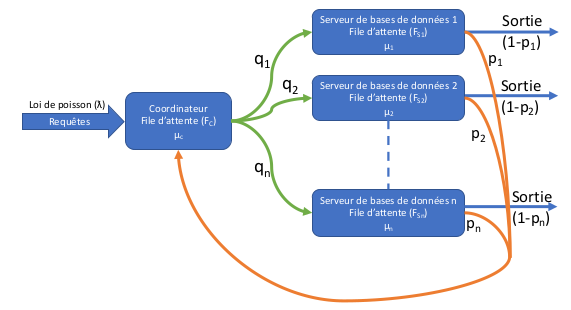
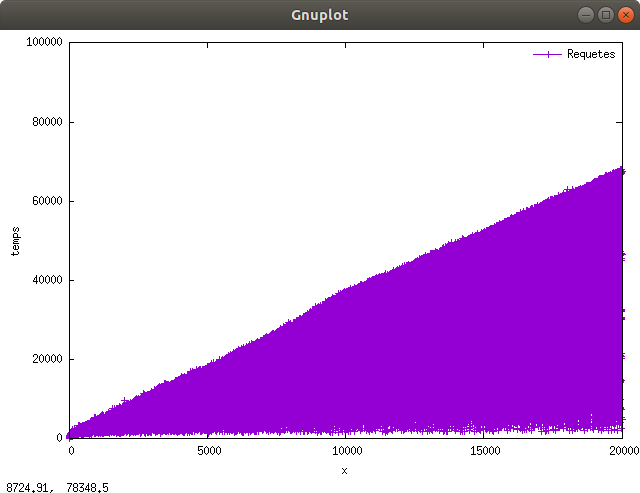
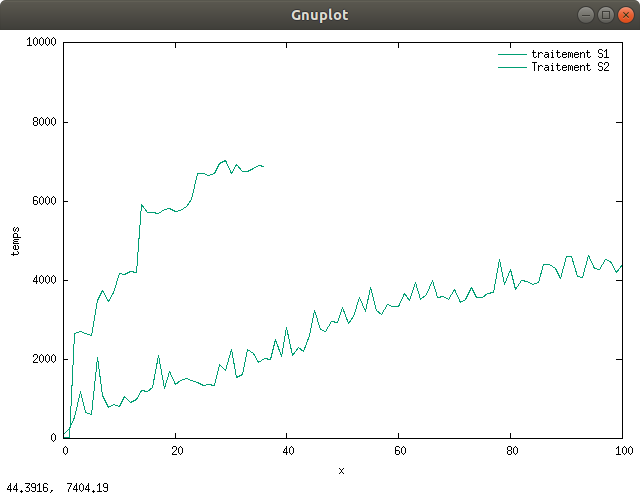

# Projet - MED 2020 -2021
### DIALLO Mamadou Saliou Dilé, CAMARA Noël
#### M1 IWOCS, groupe 2
##### Janvier 2021

## Introduction

L’objectif du sujet est d’implémenter un réseau de filles d’attentes pour simuler une base de données distribuée.
A l’aide d’un coordinateur des requêtes seront réparties sur différents serveurs de base de données pour être compiler 
et ces requêtes peuvent être composées de plusieurs sous-requêtes.
Un traitement (avec un temps de traitement) est effectué sur chaque serveur suivant une certaine probabilité.
L’orientation des requêtes vers les serveurs (file d’attente) se fait avec les probabilités qi. A la fin du traitement 
des requêtes, elles sont soit redirigées vers le coordinateur ou sorties définitivement suivant les probabilités pj.

## 1. Implémentation

Pour implémenter le programme, nous avons utilisé une classe pour les serveurs dans laquelle nous avons définie tous 
les attributs et méthodes nécessaires à la réception et au traitement d’une requête, et une classe de distribution 
dans laquelle nous avons définie tous les attributs et méthodes nécessaire à la répartition des requêtes et à la 
simulation. Et pour tracer les courbes illustrant l’arrivée des requêtes et leurs traitements , nous avons définis 
des fichiers gnuplot (avec l’extension .gnu) qui contiennent la configuration et les commandes nécessaires pour tracer 
et afficher les courbes. Résumé des classes et méthodes obtenues :
Classe Server :
- traitement(double mu, double p, double valeur): réceptionne et traite les requêtes arrivant sur le serveur.

Classe DistributedDB :
- FindX(double lambda) : génère une valeur suivant la loi de poisson pour alimenter le coordinateur.
- simulation(double lambda, double mu) : méthode principale qui oriente les requêtes vers les serveurs et qui effectue 
également la principale partie de la simulation.
- generateData(String arrive) : enregistre les données générées dans un fichier.

Fichiers gnuplot pour le traçage des courbes:
- afficheArrives.gnu : trace la courbe des arrivées des requêtes
- afficheSimulation.gnu : trace la courbe des résultats des simulations

## 2. Résultats des simulations :

## 3. Réponses aux questions

- Le système diverge
- Nombre de requêtes arrivées dans le coordinateur: 174
- Nombre de requêtes rebouclées: 1
- Nombre de requêtes traitées par le serveur: 1 173
- Nombre de requêtes restées dans le serveur: 1 1
- le temps moyen de traitement des requêtes: 3.732923164651583
- Nombre de requêtes sorties.dat du système pendant la simulation: 172

## Conclusion

À travers ce projet, on a pu comprendre par la pratique la notion de files d’attentes et comment dans une base de 
données distribuée on pouvait les utiliser pour cordonner la distribution et le traitement des requêtes. les 
perspectives d’évolution du programme pourront être d’implémenter une interface utilisateur plus conviviale et 
d’optimiser le programme afin de le rendre plus rapide.
